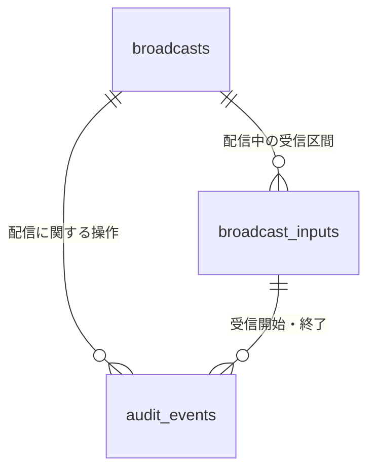
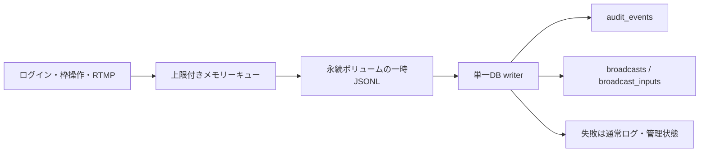

# ログイン・配信履歴の MariaDB 保存設計案

2026-09-15。**設計案・未実装・未採用**。今回は設計とDDLの提示まで。DB接続、テーブル作成、本番設定、既存仕様は変更しない。実装着手時に設計を確定しADRを追加する。

## 1. 推奨構成と対象

0yp と同じ MariaDB サーバーに、独立した `peercast_mi` DB と専用ユーザーを用意する。0yp のテーブル・ユーザーに依存しない。目的は「誰がいつログインし、どの配信を作成し、映像がいつ届き、なぜ終了したか」を管理者が後から調べられること。

- 構造化した操作・配信履歴は MariaDB に保存する。
- 接続エラー、デバッグ、記録処理自体の障害は既存の slog / コンテナログに出す。DB障害をDBにしか残さない構成にしない。
- DB待ちをログイン・RTMPの処理経路に入れない。永続ボリューム上の一時ログに退避し、非同期でDBへ取り込む。
- 初期対象は通常のXログイン、ログアウト、サイトのキー発行・再発行、ローカル配信枠の作成・変更・終了、RTMP Publishの承認・拒否、実メディア受信開始・終了。上流PCPからのリレーや個々の視聴者アクセスは対象外。
- 管理API・エンコーダー切断・自動削除・正常終了からの停止も配信終了として拾う。サイトの停止ボタンだけでは記録が欠ける。
- 開発ログインはsourceで区別する。ログイン成功前の失敗はX ID不明のまま残し、入力値から本人を推定しない。
- 過去10件の配信フォーム設定とストリームキーのJSON保存は当面維持する。DB移行を本機能に抱き合わせない。

初期導入では保存とSQLでの参照までを実装し、管理画面の検索・一覧は次段階とする。一般利用者向けの履歴公開APIは追加しない。

## 2. 現在の実装から必要になる点

参照: peercast-mi `37b5f4a`（作業開始時clean）、peercast-0yp `c278834849977b4c725eaad85626b75fe5bf7b51`（参照時clean）。[0ypとの比較記録](../reviews/2026-09-15-audit-design-0yp.md) にソース・採用点・差異を記録。

0yp の `channel_sessions`（掲載期間）と `channel_snapshots`（10分間隔の状態）を参考に、miでも1回の配信履歴と時系列の原記録を分ける。`internal/archive` 相当の記録処理と `internal/repository` 相当のSQL層を分離し、`database/sql` / `go-sql-driver/mysql` を用いる案。0ypのテーブルを直接参照・変更しない。

ただし0ypが観測するYP掲載期間、miの配信枠の存在期間、実メディア受信区間は別の時間。0ypのstarted_atをmiの配信開始時刻に流用しない。miのログインと停止は瞬間的な操作なので、1秒ポーリングだけでなく発生箇所からイベントを採取する。視聴人数の10分グラフは今回の対象外とし、0ypのsnapshotテーブルを複製しない。

| 現在の箇所 | 設計への影響 |
| --- | --- |
| `internal/site/server.go`: callback / startSession / logout | X ID確定後の成功、失敗コード、ログアウトをここで採取。Cookie等の実セッション値は保存しない |
| `internal/site/broadcast.go`: broadcast / stopBroadcast | 本人と作成要求IPが分かる。履歴JSON保存失敗で作成枠を取り消す既存経路も記録対象 |
| `internal/channel/manager.go`: Broadcast / Stop / StopAll | 同じ入力でChannelIDを再利用する。作成・終了の共通通知が必要 |
| `internal/rtmp/server.go`: OnPublish / writeData / OnClose | Publish承認はメディア受信開始ではない。書込先はキーから毎回解決し、同じ接続中に配信枠が変わり得る |
| `internal/site/client_ip.go` | ログイン・作成のHTTP元IPにも同じ信頼プロキシ判定を使用。認証の判定条件は変えない |

**broadcast_id は今回の配信履歴IDを指す。PCPのBroadcastIDや既存 `broadcast_id` ファイルとは別物。** Go側は `BroadcastRunID` のように区別して命名する。

## 3. 識別子と時間

| 識別子 | 意味 |
| --- | --- |
| `node_id` | 設定で固定するノード名。再起動後も同じ。例 `mi-production` |
| `boot_id` | プロセス起動ごとのランダム128bit ID |
| `event_id` | イベント生成時のランダム128bit ID。再送時も同じ |
| `boot_seq` | その起動内の採番。時刻変更や同時刻の操作を順序付ける |
| `session_ref` | ログイン成功時に生成するログ専用ID。Cookie・CSRFトークンとは独立 |
| `broadcast_id` | ローカル配信枠のインスタンスごとに生成。同じChannelIDで再作成しても別ID |
| `connection_id` | RTMP接続ごと。キーを識別子やハッシュに使わない |
| `input_id` | 同じ配信枠・接続でメディアを書き込む連続した区間ごと |

日時はUTCの `DATETIME(6)`、画面表示時だけJST等へ変換する。0ypはJST / loc=Localの設計だが、miは複数の接続・操作の発生時刻と再送時刻を明示的に扱うためUTCとする。DBセッションのtime_zoneも `+00:00` にし、Go側はUTCへ変換して渡す。0yp側の時刻設定は変更しない。`occurred_at` は発生時刻、`recorded_at` はDB取り込み時刻。停止中の滞留を区別できる。順序制御は日時ではなくboot_seqや各履歴のrevisionを使う。IDは小文字hex32文字としてアプリで生成し、DB接続がなくても採番できる。

## 4. テーブル設計

[DDL案](site-audit-schema.sql)。InnoDB / utf8mb4。IPはIPv4・IPv6を正規化した `VARCHAR(45)` で保存し、ポートは含めない。頻繁に検索する項目は通常カラムにし、イベント固有の少数の補足だけJSONに入れる。



図は論理関係。ログイン・キー発行のイベントはbroadcast_idなし。FKは初期案では設けない。欠けたイベントの取り込みや期限削除を親行の存在で止めないためで、整合性はwriterの同一トランザクションと照合ジョブで確認する。関連行がないイベントは隠さず「一部の履歴が未記録」と扱う。

### 4.1 audit_events — 操作の原記録

1イベント1行。更新しない（保存期限による削除のみ）。

| カラム群 | 用途 |
| --- | --- |
| event_id / node_id / boot_id / boot_seq | 再送の重複防止、起動と順序の特定 |
| occurred_at / recorded_at | 発生と遅延取り込みの区別 |
| event_type / source / outcome / reason_code | 種類、発生経路、成否、機械判定用理由 |
| actor_account / actor_name | 操作した人。例 `site:x:121039382`。システム処理や未認証失敗ではNULL |
| owner_account | 対象配信・キーの所有者。管理者と所有者を混同しない |
| client_ip | HTTPの解決済み元IP、RTMPならソケットIP。意味はsourceで区別 |
| session_ref / broadcast_id / input_id / connection_id / channel_id | 相関用ID。該当しないものはNULL |
| payload_version / payload | イベント型ごとの許可項目。後述の履歴スナップショット等 |

Xユーザーのマスターテーブルは初期段階では不要。安定したaccountと発生時の表示名を保存し、改名後も当時の記録を読めるようにする。実セッション保存にも使わない。

### 4.2 broadcasts — 配信枠1回の履歴

1回の枠作成から終了まで1行。audit_eventsから同時更新する検索用の集約テーブル。

- owner_account / owner_name: 作成時点の所有者。非サイトの管理配信などで特定できない場合はNULL。
- created_by / source / create_ip: 作成者と作成経路。RTMPのIPと区別する。
- channel_name / input_genre / genre / description / comment / contact_url / bitrate / content_type: 作成成功時の設定を通常カラムに保存する。0ypのメタデータカラム方式を踏襲する。input_genreは補完前（管理API等で不明ならNULL）、genreは公開値。名前・ジャンルはmiの上限に合わせ256文字、詳細・コメント・URLはTEXTとし、書込時に既存の2048 bytes上限を検証する。0ypの255文字をそのまま流用しない。秘密のキー・ソースURLは含めない。
- status: `waiting`（メディア未受信）、`live`（一度でも受信し、枠が未終了）、`ended`（終了を観測）、`interrupted`（再起動等で終了時刻不明）。liveは現在もフレームが届いている保証ではない。
- first_media_at / last_media_at: 最初と最後に観測したメディア時刻。
- ended_at: 停止処理を観測した正確な時刻。未終了や異常終了で不明ならNULL。
- interruption_detected_at: 次の起動などで中断を検知した時刻。これをended_atとして偽装しない。
- incomplete: 記録の欠落・異常終了で完全性が確認できない場合true。
- revision / source_event_id: スナップショットの世代と更新根拠。古い再送で状態を巻き戻さない。

ChannelIDにUNIQUE制約は付けない。「誰の配信か」と「誰が停止したか」は別で、停止した管理者はイベントに記録する。メタデータ変更はイベントに残し、このテーブルの作成時設定を上書きしない。

### 4.3 broadcast_inputs — 実メディアの受信区間

1つの配信枠とRTMP接続の組み合わせで、初回メディア書込から切断・停止・書込先変更まで1行。

- started_at: AVC/AACヘッダーやPublish承認ではなく、最初に配信チャンネルへ実メディアを書き込んだ時刻。
- remote_ip: RTMP接続元。HTTPプロキシのヘッダーは使用しない。
- last_media_at: メディア到着を観測した最後の時刻。稼働中は最大60秒ごとにDBへ反映し、正常終了時に最終値を反映。
- ended_at / interruption_detected_at / incomplete: broadcastsと同じ区別。
- end_reason: `encoder_disconnect`、`user_stop`、`admin_stop`、`idle_cleanup`、`server_shutdown`、`target_changed`、`setup_rollback`、`process_interrupted` 等。

同じRTMP接続が新しい配信枠へ移る場合は、古いinputを終了し新しいbroadcast_idに別inputを作る。停止時は可変のキーから探し直さず、実際に結び付けた配信インスタンスとinput_idで閉じる。これにより旧接続の終了を新しい枠の終了として記録しない。

配信時間は正常に閉じた受信区間の**和集合**で計算する。複数接続の重複区間は二重加算しない。これは接続下での受信区間であり、視聴者の再生時間・無欠落の映像時間ではない。未終了区間や異常終了を含む配信は「暫定／一部不明」とし、last_media_atからの値を確定時間に加えない。初期版ではdurationの保存カラムを置かない。

### 4.4 schema_migrations

DDL適用バージョンとチェックサム。運用ツール専用。実行ユーザーとマイグレーション用ユーザーを分け、通常プロセスにはCREATE / ALTER / DROP権限を与えない。

## 5. イベントの一覧

| event_type | 発火点・結果 |
| --- | --- |
| auth.login | X交換・セッション発行の成功／失敗／キャンセル。成功前はactor不明の場合あり |
| auth.logout | 明示ログアウトのみ。ブラウザーを閉じた時刻とは解釈しない |
| key.issue / key.rotate | 発行・再発行の成功／失敗。キー本体は保存しない |
| broadcast.create | 作成完了／失敗。JSON履歴保存の取り消しはfailureとsetup_rollback |
| broadcast.metadata | 名前・ジャンル・コメント等の変更。旧新の許可済み項目だけ |
| broadcast.end | 全停止経路。対象なしの再停止は終了を重複生成しない |
| rtmp.publish | Publish承認／拒否。承認してもまだメディア開始とはしない |
| input.start / input.end | 実メディア区間の開始／終了 |
| input.progress | 稼働区間の最終メディア時刻を最大60秒ごとに反映 |
| system.start / system.stop | プロセス起動／正常終了 |
| broadcast.interrupted | 前回起動の未終了枠を再起動後に中断扱いにする |
| audit.gap | 再開後に判明したログ欠落件数・採番範囲。復元できたという意味ではない |

セッションの自然失効は正確な操作時刻ではないため、初期版では明示ログアウトと混ぜて記録しない。reason_codeは固定リスト、元のOAuth応答本文やRTMP PublishingNameは記録しない。大量の失敗は同一原因・IPで1分単位に集約し、payloadに件数とfirst/last時刻を残す。成功イベントは集約しない。

## 6. 書込と障害時の動作



### 通常時

同じnode_id・一時ログディレクトリを複数の稼働プロセスで共有しない。プロセスごとに排他を取り、二重起動を検知した場合は記録機能を劣化状態にして旧bootの終了照合を実行しない。

1. 操作結果と必要なスナップショットを取得し、ID・revision・boot_seqを採番。キューへの投入は非ブロッキング。Manager等のロック内でSQL・ファイルI/Oをしない。
2. 単一writerが一時ファイルへ追記し、同期後にDBへ送る。初期案はキュー4096件、一時ファイル1本32MiB、合計512MiB、1イベント64KiB以下。同期は最大250msまたは256件単位。
3. 1イベントのINSERTと集約テーブルのupsertを同一トランザクションでcommit。commit済みevent_idの再送は成功扱いで集約更新もしない。一般の制約違反まで `INSERT IGNORE` で隠さない。
4. 各配信イベントのpayloadに、生成時点でのbroadcast_snapshot、必要時input_snapshotを含める。対象ID・revisionも含め、順序が前後しても新しいrevisionだけを適用する。作成イベントが欠けても後続の完全スナップショットから履歴を復元可能とするが、欠落はincompleteとして残す。
5. DB応答の曖昧な失敗は同じIDで再試行。commit済みの範囲だけ読込位置を更新。位置更新に失敗しても再送は重複しない。全件ack済みのファイルだけ削除する。

共通Manager通知とサイト側の操作完了を二重のcreate成功として記録しない。サイトのJSON履歴保存までを含む作成手順を完了・失敗の境界とし、内部枠の作成／取り消しと区別する。変更・停止の呼出元はActorContextを渡し、システム起因は固定reasonを付ける。通知インターフェースは channel / rtmp / site にDB依存を持ち込まない。

### DB停止・容量不足・強制終了

- DBが利用できなくてもサイト・配信を起動する。接続・スキーマの検査はwriter側で行い、未適用スキーマも取り込み停止・劣化状態として見せる。
- 接続タイムアウト2秒、SQLタイムアウト3秒、再試行1〜60秒の待ち時間を付ける案。通常のDB接続は最大2本程度から始める。
- DB停止時は一時ファイルに蓄積し、復旧後に採番順で再送する。
- キュー満杯・一時領域満杯・権限エラーでは配信を止めず、新しいイベントを破棄して欠落件数と時刻を通常ログに出す。未取り込みファイルを黙って削除しない。
- 再開後はaudit.gapを生成。記録処理のエラーを同じキューへ再帰投入しない。
- 電源断・プロセス強制終了では、未同期の最大250ms分に加えメモリーキュー内のイベントが失われ得る。ディスク自体の故障でも失う。これは「記録失敗で配信を止めない」方針の明示的な限界であり、無欠落の監査証跡を保証するものではない。
- 永続ファイル末尾の途中書込は、最後の完全なJSON行まで読み取る。中間破損・未知payload_versionは隔離して劣化表示し、後続の正しいイベントまで永久に詰まらせない。
- 再起動時は過去bootの一時ファイルを先に取り込み、その後、同じnode_idの旧bootでwaiting/liveの行をinterruptedにするイベントを生成する。DBが落ちている間は照合を延期。終了時刻はNULL、検知時刻は別カラムとする。新bootの稼働行は閉じない。
- 正常終了時はStopAll由来の終了イベントを採取後、最大5秒でキュー・一時ファイルを同期する。DB復旧までは待たない。

## 7. 既存の配信設定履歴との関係

今回のDBは運用記録で、配信の動作に必要なマスターではない。キー・セッション・直近10件設定の読み書きをDBへ移さない。したがって、DB停止で配信を止めない方針は、既存JSON履歴保存の失敗で作成を取り消す仕様を変更しない。

運用履歴は90日で消しても、以前の設定10件は維持できる。将来フォーム設定をDBへ移す場合は、保持条件・DB停止時の初期値・書込失敗時の扱いを別途設計する。既存JSONを無条件に削除したり、自動移行したりしない。

## 8. 閲覧・保持・バックアップ

- 管理者のX許可リスト内だけが将来の管理APIを利用する。履歴の閲覧・検索・エクスポートを一般サイトAPIに追加しない。
- 主な検索: 日時範囲、操作者／所有者、イベント種類、チャンネルID、配信履歴ID。IP検索は初期版では期間を必須にして行い、利用頻度を見て索引を追加する。
- アカウントごとの最新履歴は複合索引から、日時とIDのカーソルでページ送りする。JSON本文全体へのLIKE検索を通常経路にしない。
- 推奨保持期間は90日（未確定の設定値）。イベントはoccurred_at、終了済み配信はended_at、中断配信はinterruption_detected_atを基準にする。未終了枠は期限だけで消さず、先に再起動照合を行う。
- 期限削除は1回1000件等の小分け処理。終了済み枠のinputを先に削除し、broadcastを削除する。イベントは独立に期限削除する。長期稼働枠は原イベントの一部が先に失効しても集約行は維持する。
- 90日を超えた滞留イベントを復旧時に取り込んで保持期限を延ばさない。古い終了履歴は取り込みをスキップしてackし、破棄件数を記録する。ただし未終了枠の照合に必要な最終スナップショットは照合にだけ使い、終了時刻を推測しない。
- 原記録が消えた後の集約の完全再生成は保証しない。DBと一時ファイルのバックアップは別に必要。
- 認証用Cookie、OAuth code/token、CSRF、キーの平文・ハッシュ、RTMP URLのキー部分、未加工HTTPヘッダーは保存しない。短いキーのハッシュも総当たり可能なため残さない。
- DB専用ユーザーはmi専用DBのSELECT/INSERT/UPDATE/DELETEのみ。接続情報は0ypと同様に環境変数から受け取るが、mi用の `PEERCAST_AUDIT_DB_HOST/PORT/NAME/USER/PASSWORD` として区別する。ドライバーのConfig/FormatDSNを使用し、パスワードの記号を文字列連結で壊さない。parseTimeとUTCを指定し、ログ・TOML・Gitに資格情報を出さない。
- 管理状態に記録機能の正常／劣化、最終DB成功時刻、未送信件数・バイト数、欠落件数を出す。一般利用者のフォームには運用情報を増やさない。

## 9. SQL参照例

```sql
-- あるユーザーの最近のログイン。値はプレースホルダーで渡す。
SELECT occurred_at, outcome, client_ip, reason_code
FROM audit_events
WHERE actor_account = ? AND event_type = 'auth.login'
ORDER BY occurred_at DESC, event_id DESC LIMIT 50;

-- 配信履歴。作成時刻を配信開始時刻として表示しない。
SELECT broadcast_id, channel_name, created_at, first_media_at,
       ended_at, status, incomplete
FROM broadcasts
WHERE owner_account = ?
ORDER BY created_at DESC, broadcast_id DESC LIMIT 50;

-- 1回の配信のRTMP受信区間。重複区間の統合はアプリ側で行う。
SELECT remote_ip, started_at, last_media_at, ended_at, end_reason, incomplete
FROM broadcast_inputs
WHERE broadcast_id = ? ORDER BY started_at, input_id;
```

## 10. 実装の段階と確認項目

1. MariaDB実バージョン、miコンテナからの接続方法、バックアップ運用を確認。別の使い捨てDBでDDL・ロール権限・日本語／IPv6／NULL・索引を検証。`database/sql` と0ypでも使用する `go-sql-driver/mysql` を候補とし、導入時に互換性を確認する。
2. ログ専用ID、イベント型、共通ライフサイクル通知、JSONL退避と再送を実装。通常経路にSQLを呼ばないことを確認。
3. 3テーブルへの同一トランザクション保存、復旧照合、期限削除、記録機能の状態表示を実装。
4. 検証: DB停止中のログイン・配信継続、再起動して再送、commit後の接続切断、二重イベント、時刻逆行、キュー満杯、ディスク満杯、中間／末尾破損、期限超過の再送、同じChannelIDの再配信、OBS接続継続中の枠切替、複数入力の重複区間、停止競合、履歴JSON保存失敗、キー／トークン不混入。
5. 別途管理画面を追加。権限・ページ送り・保持期間の境界・不明な終了時刻の表示をテストする。

検討した代替: ファイルだけでは管理検索・集計がしにくい。DBへの同期INSERTは障害時に配信経路を遅らせる。イベントテーブルだけでは配信時間・状態の問い合わせが複雑になる。全データをDBへ移す案は、今回の記録保存より変更範囲が大きい。

### 今回の設計検証の範囲

ローカルコードのライフサイクルと保存済み運用資料を確認し、DDL・キー・索引・NULL・復旧手順の整合をレビューした。**本番MariaDBのバージョン取得、接続、DDL実行、性能試験は未実施**。DDLは実行可能性を保証したマイグレーションではなく、実装前のレビュー用定義。Go実装変更がないためGoテストは実行しない。

MariaDBのJSONはLONGTEXTベースの型として扱われるため検索の主軸にしない。[MariaDB JSON公式資料](https://mariadb.com/docs/server/reference/data-types/string-data-types/json)
日時の精度はDATETIME(6)を使用する。[MariaDB DATETIME公式資料](https://mariadb.com/docs/server/reference/data-types/date-and-time-data-types/datetime)
